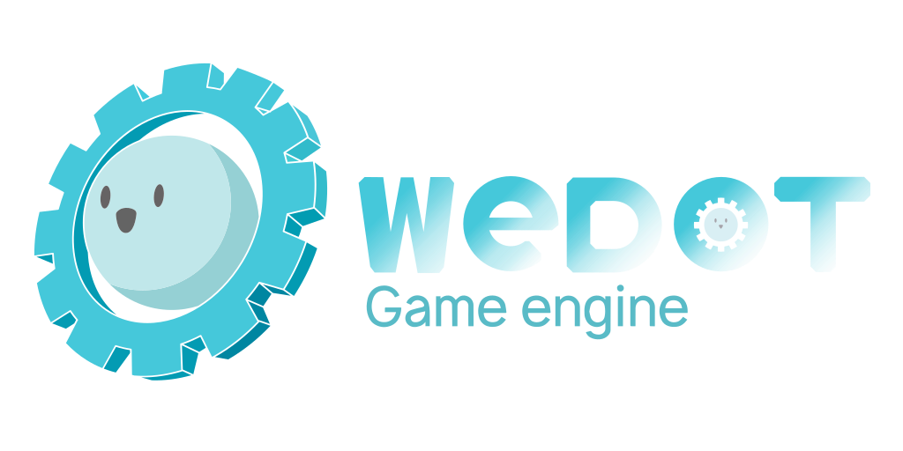

<h1 align="center">
  
</h1>

    
    
    

> 🌏 简体中文 | [English](./README_EN.md)

WeDot 是一个专注于技术和用户体验的多平台 2D 与 3D 游戏引擎，开发者可以把注意力集中在游戏开发本身，而非繁杂的技术细节。

> ## 我们承诺
> **无政治元素**：WeDot 致力于纯粹的游戏开发。让游戏引擎回归游戏的本质。
>
> **开源与透明**：我们坚持开源精神，所有开发进展和决策过程都将公开透明。
>
> **社区驱动**：我们重视社区的反馈和贡献，鼓励开发者参与引擎的改进和发展。

## 开始使用

- [Wedot文档](https://docs.wedot.top/)

## 当前计划

1. 集成新的 3D 物理引擎 [Jolt.](https://github.com/jrouwe/JoltPhysics)
2. 添加简单的后处理功能以增强渲染效果。
3. 创建源代码教程，吸引更多人加入我们的社区。
4. 优化性能，提高引擎在不同平台上的运行效率。
5. 扩展文档，提供更详细的使用指南和技术支持。
   
## 如何维护

- [贡献指北](./CONTRIBUTING.md)

## 交流方式

- [网站](https://wedot.top)
- [QQ 群](https://qm.qq.com/cgi-bin/qm/qr?authKey=G%2BR%2FKlLQBeH71b1Mhe4t2gM%2B8rLXndOEPhPtDgWgTudLUtGUgpMrNAWD87x%2F64ta&k=IPTGQ3zH_W8IAzaFrnLLGF2kplhv-EeM&noverify=0&group_code=670915303)
- [Discord](https://discord.com/invite/MRssAz6Pe3)

## 当前状态

